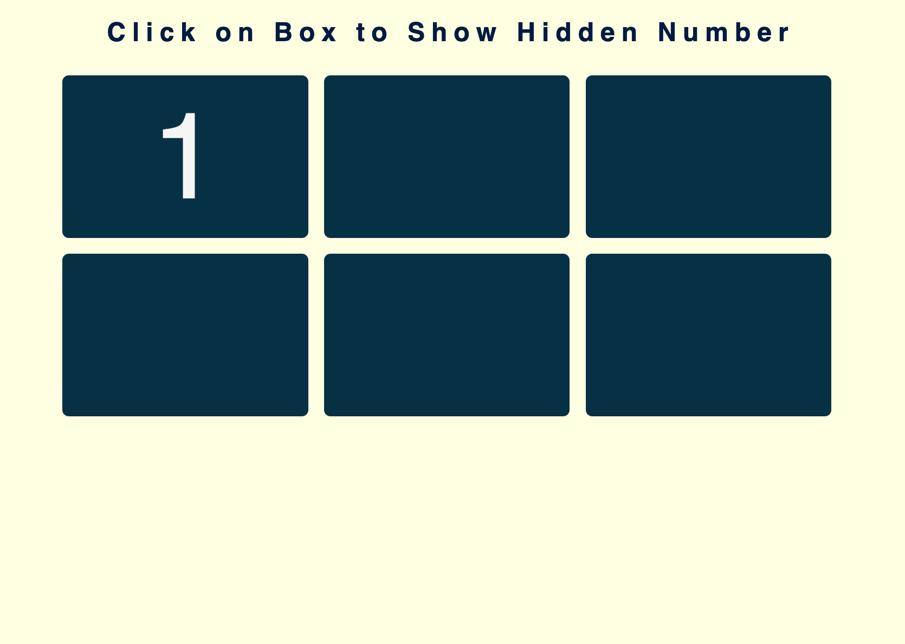

# card-display

As a player, I want to click on a card and view the hidden number.

## Behaviour

When I click on a card, the hidden number is revealed.
When I click again, the number is hidden.

The following image demonstrates the web application's appearance and functionality:

